# Dev-Sync 🚀

A full-stack developer collaboration platform built with the **MERN Stack** that enables developers to connect, collaborate, seek technical assistance, and communicate in real time.

🌐 **Live Demo:** [dev-sync-akp3.vercel.app](https://dev-sync-akp3.vercel.app/)

---

## 📸 Preview

### 🔐 Registration & Welcome Email

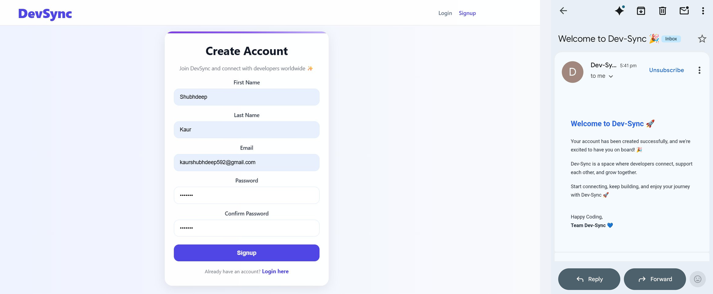

---

### 🏠 Home Feed · Edit Profile · My Profile

| Home Feed | Edit Profile | My Profile |
|-----------|--------------|------------|
| 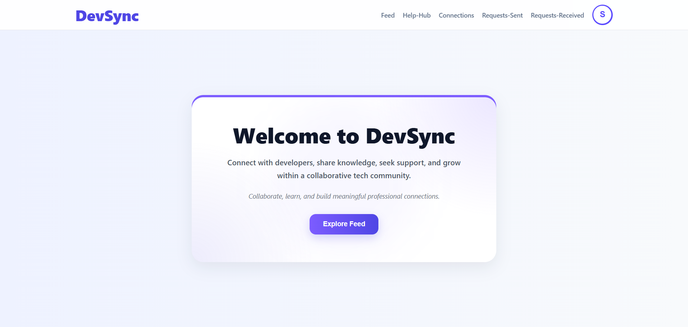 | 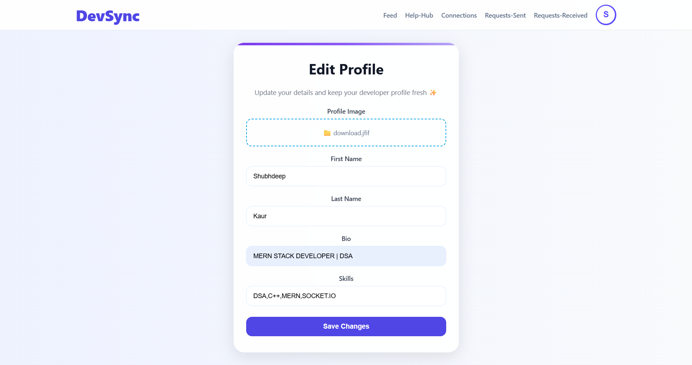 | 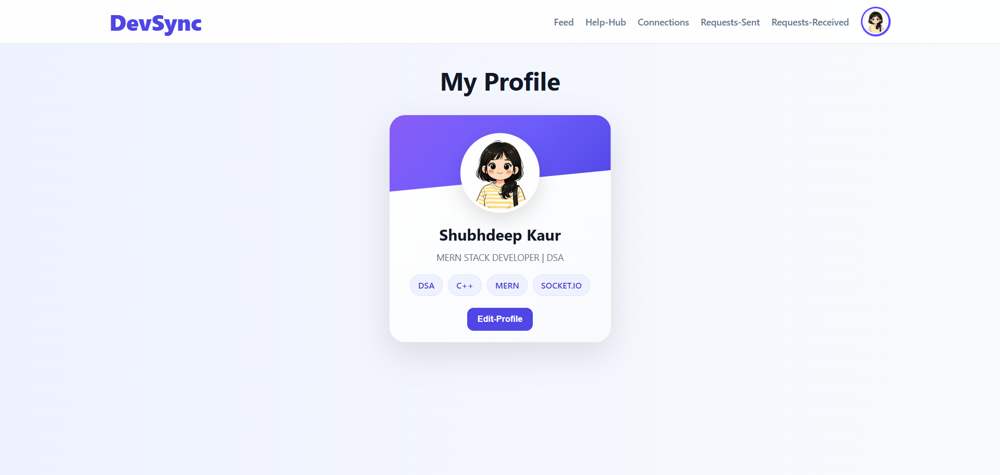 |

---

### 📬 Pending Requests

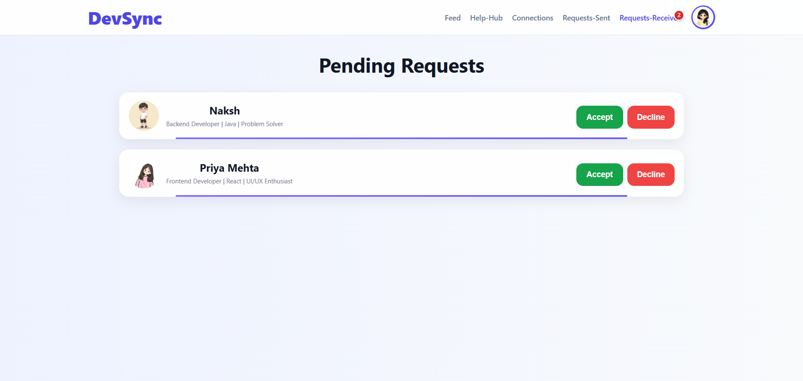

---

### 🤝 Connections · Real-Time Chat

| Connections | Dev Chat |
|-------------|----------|
| 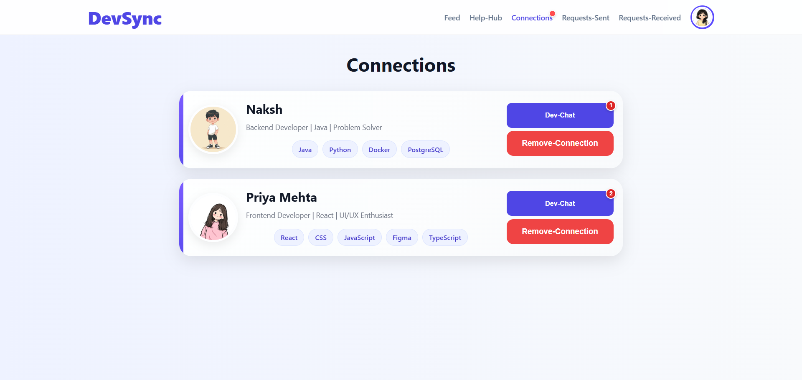 | 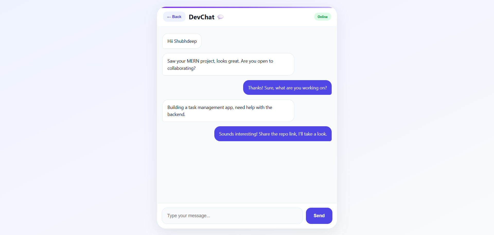 |

---

### 📰 Feed

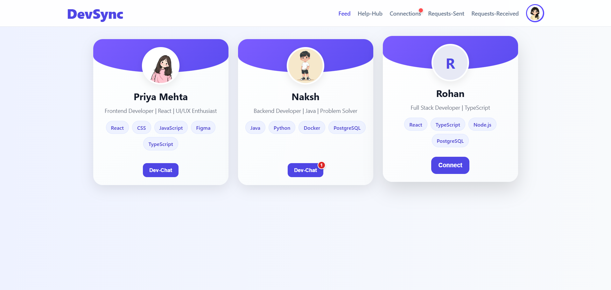

---

### 🆘 Community Help Hub

| Help Hub | My Help Hub |
|----------|-------------|
| 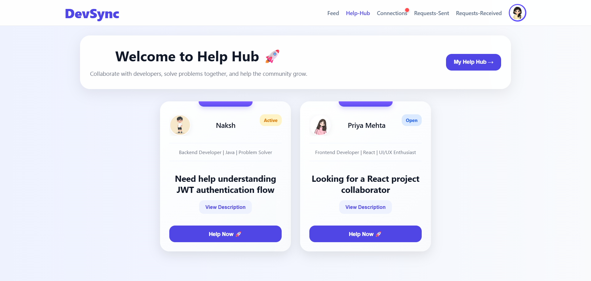 | 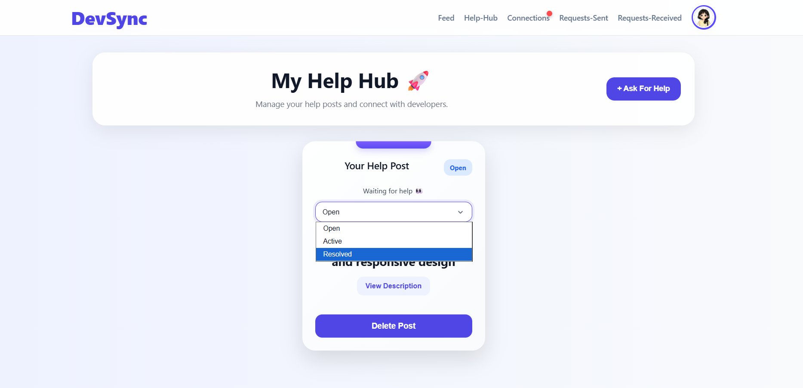 |

---

### 🔑 Forgot Password & Email Recovery

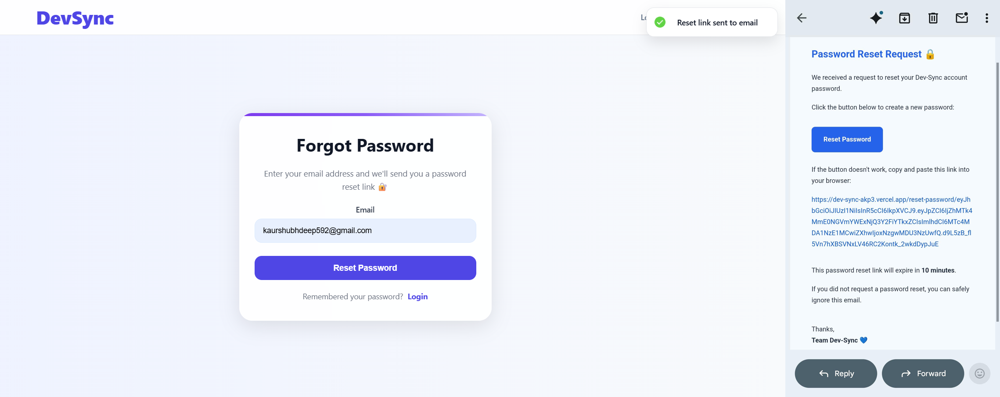

---

### 📱 Mobile View

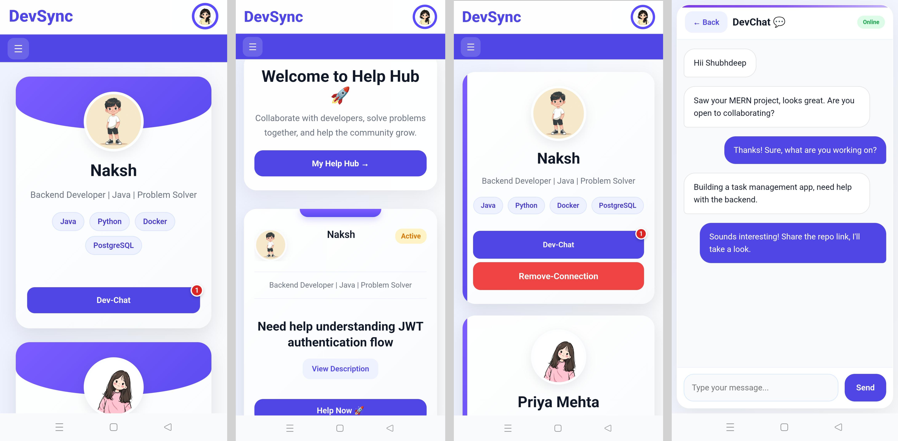

---

## ✨ Features

**Authentication & Security**
JWT-based auth, secure login/signup, email-based password recovery, and protected routes.

**Developer Profiles**
Create and manage profiles, upload profile pictures via Cloudinary, showcase skills and info.

**Connection Management**
Send, accept, or reject connection requests. Manage pending requests and view your network.

**Help Hub**
Post technical help requests, offer assistance to others, and track status — Open, Active, or Resolved.

**Real-Time Chat**
One-to-one messaging between connected developers powered by Socket.IO.

**Responsive Design**
Optimized for both desktop and mobile devices with a clean, modern UI.

---

## 🛠️ Tech Stack

| Layer | Technologies |
|-------|-------------|
| Frontend | React.js, React Router, CSS3 |
| Backend | Node.js, Express.js |
| Database | MongoDB, Mongoose |
| Auth | JWT, bcrypt |
| Cloud | Cloudinary |
| Email | BrevoMailService |
| Real-Time | Socket.IO |

---

## 🚀 Getting Started

### Clone the Repository

```bash
git clone https://github.com/shubh604/Dev-Sync.git
cd Dev-Sync
```

### Install Dependencies

```bash
# Frontend
npm install

# Backend
cd backend
npm install
```

---

## ⚙️ Environment Variables

Create a `.env` file inside the `backend` directory:

```env
DATABASE_URL=your_mongodb_connection_string
PORT=4500
JWT_SECRET=your_secret_key

#Cloudinary
CLOUD_NAME=your_cloud_name
API_KEY=your_cloud_api_key
API_SECRET=your_cloud_api_secret

#Brevo Mail
MAIL_USER=your_email
BREVO_API_KEY=your_brevo_api_key

#Reset password token
CLIENT_URL=http://localhost:3000
RESET_SECRET=your_jwt_reset_secret_key

NODE_ENV=production
FRONTEND_URL=http://localhost:3000
```


Create a `.env` file inside the `frontend` directory:
```env
REACT_APP_BACKEND_URL=http://localhost:4500
CI=false
```
---

## ▶️ Run the Application

```bash
# Backend
npm run dev

# Frontend
npm start
```

---

## 🔮 Future Improvements

- Group Chats
- Developer Search & Filters
- Project Collaboration Rooms
- Push Notifications
- Enhanced Activity Feed

---

## 👩‍💻 Author

**Shubhdeep Kaur**
Computer Science Engineering Student · MERN Stack Developer · DSA

---

⭐ If you found this project interesting, consider giving it a star!